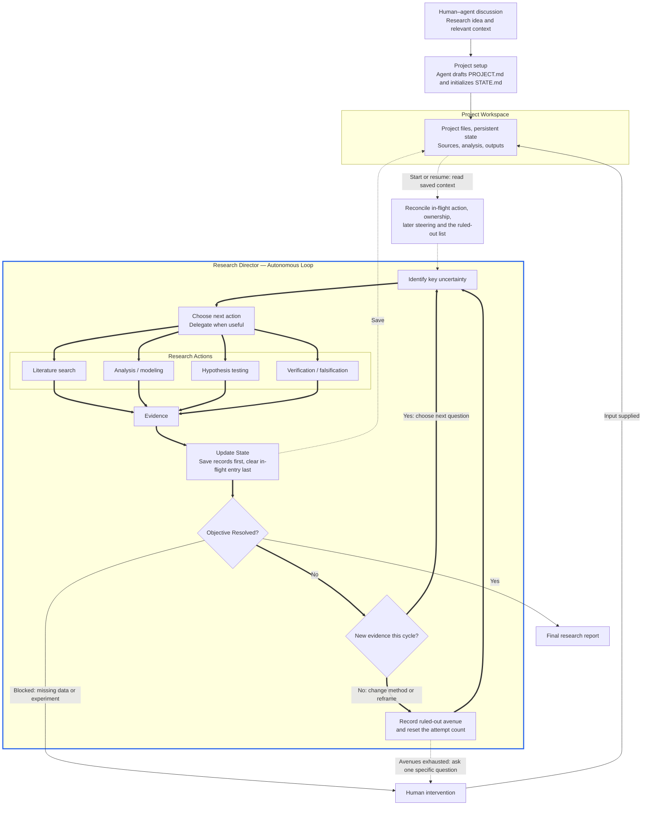

# Autonomous Research Architecture

A human and agent discuss a research idea; the agent translates it into the project brief and initial state. The director then selects useful actions and repeats the evidence-driven loop. The workspace preserves progress across runs. Both canonical prompts are in [README.md](README.md#start-a-project).

Across runs the loop is made restartable by `STATE.md`'s continuity fields. One session owns the checkpoint at a time. Intent for an external, irreversible, or long-running action is recorded before the action, so an interrupted run leaves a detectable UNKNOWN outcome to verify rather than a silent gap. Records and artifacts are written before the state that references them, and the in-flight entry is cleared last. A cycle that produces no new evidence changes method, reframes the question, or is recorded as ruled out, so a fresh agent neither repeats a dead end nor loops on one avenue forever. See [persistent loop robustness](AGENTS.md#persistent-loop-robustness).
