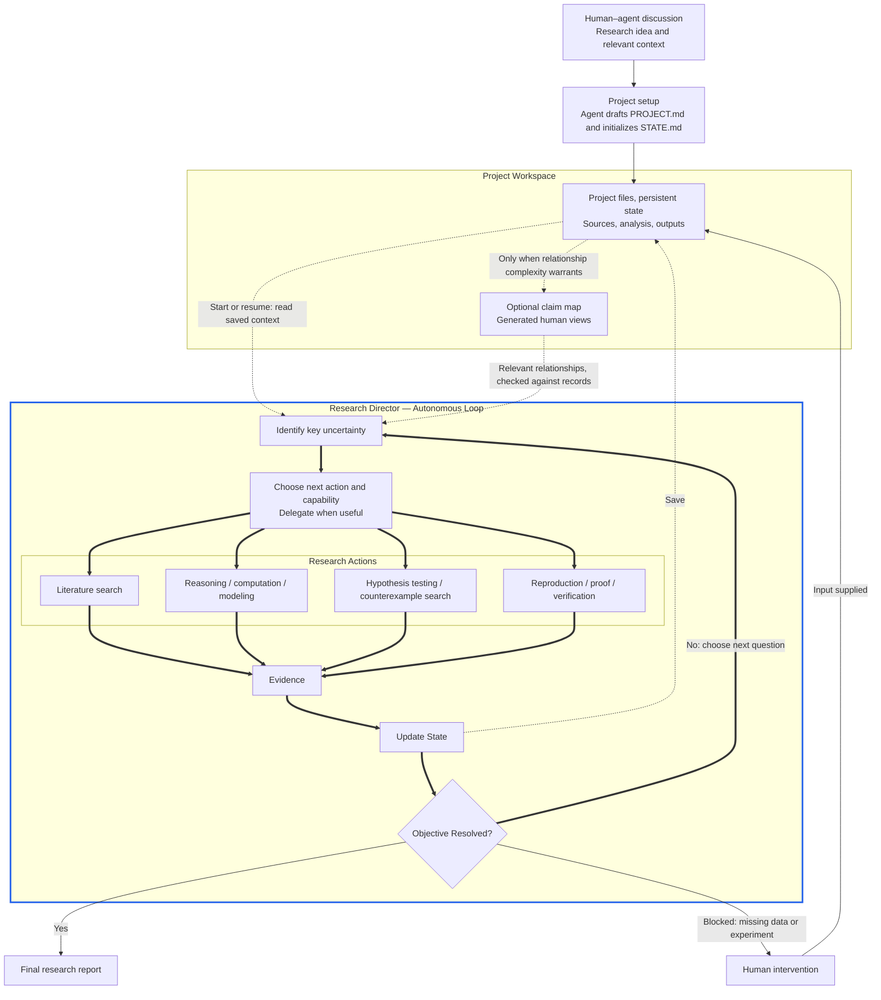

# Autonomous Research Architecture

A human and agent discuss a research idea; the agent translates it into the project brief and initial state. The director then selects useful actions and repeats the evidence-driven loop. The workspace preserves progress across runs. Both canonical prompts are in [README.md](README.md#start-a-project).

The director selects [capabilities](AGENTS.md#mathematical-and-computational-research) to address gaps within the same adaptive loop. Escalation introduces no mandatory sequence or dependencies.

When relationships become difficult to follow, an [optional claim-centered map](KNOWLEDGE_MAP.md) connects results, assumptions, prior work, and open questions. E/D/H records retain canonical evidence and reasons for changes; `STATE.md` retains the current answer, remaining gap, and next action. Map views communicate relationships without replacing either.

