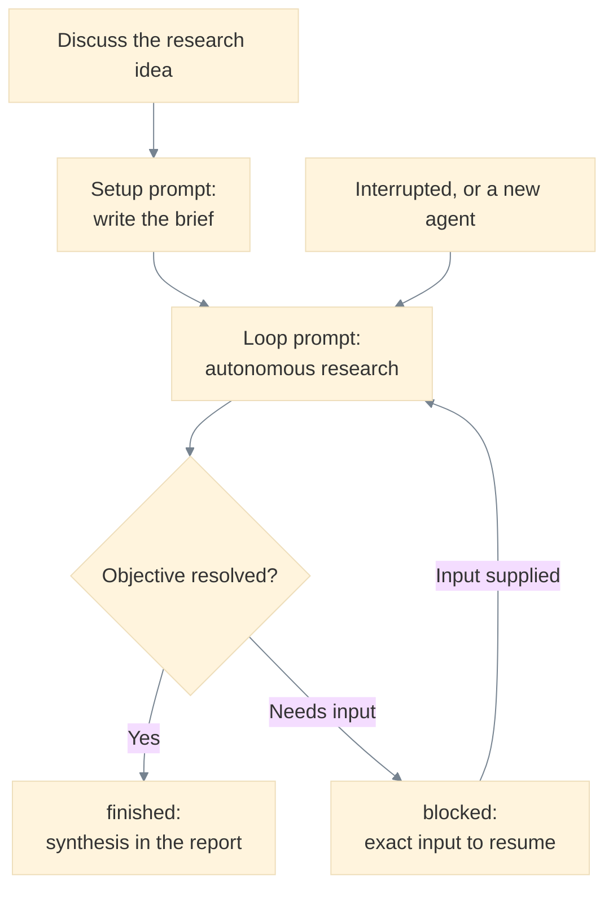
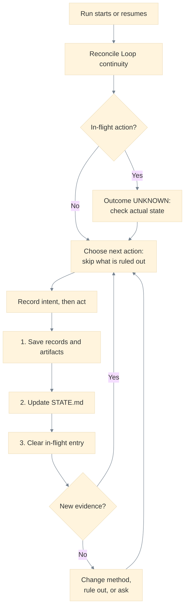

# Autonomous research template

A small, tool-agnostic workspace for investigating a question, testing explanations, and producing an evidence-backed answer. Plain Markdown preserves the investigation across agents and interruptions. A capable agent with suitable research tools performs the work; this template does not itself run an agent or schedule background work.

## Start a project

**Human–agent discussion → project setup → persistent research loop.**

1. Discuss your research idea naturally with a capable research agent. Explain what you want to learn and share any relevant private context, resources, or constraints. You do not need to design a brief or research plan.
2. Copy this template into a new project directory, or create a repository from it, using the blank template files. Open that directory in the agent with the discussion available; if switching conversations, bring a summary and links to supplied materials. The template's design-prompt history is not needed in new projects.
3. Send the setup prompt below. The agent writes [PROJECT.md](PROJECT.md) and initializes [STATE.md](STATE.md), leaving the project ready to run.



Setup runs once per project. The loop prompt is reusable: every later run, including a fresh agent, re-enters at the same point using the saved files. A finished project may be an answer, a qualified answer, surviving alternatives, a negative result, or a currently unresolvable question.

### Set up from the discussion

```text
Read AGENTS.md and set up this new research project from our preceding
discussion. Write PROJECT.md with the objective, relevant context, constraints,
supplied resources, desired outputs, stopping conditions, and important
unknowns. Initialize STATE.md with inferred practical success criteria, labeled
assumptions, the key uncertainty, and a concrete next action. Preserve supplied
originals and distinguish human-provided information from agent inference. Ask
only for essential inaccessible information or consequential choices that depend
on my priorities; do not ask me for discoverable background or a research plan.
Keep setup compact and stop with the workspace ready for the research loop.
```

Only a research question is required; the agent can help phrase it from the discussion. For example: “I want to understand why these sensor measurements drift and whether either of our two calibration methods explains it.” A little context about the apparatus and links to the measurements are enough to set up that investigation. The agent infers what a useful answer would establish and discovers public background during research. You can also edit `PROJECT.md` directly and proceed to the loop prompt.

### Start or resume the research loop

```text
Take ownership of the research question in this repository and drive it to an
evidence-backed answer.

Read AGENTS.md first and follow it. It defines the workflow, the evidence and
provenance conventions, your authority limits, and the stopping rules. Let it
route your other reading; PROJECT.md holds the brief and STATE.md the current
checkpoint. Reconcile that checkpoint against the saved records and artifacts
before you act on it.

Work in many actions, not one: pick the uncertainty that most affects the answer,
reduce it, record the evidence, then pick the next. Decide routine reversible
things yourself instead of asking permission for work you are already authorized
to do. Seek the strongest counterevidence before accepting an important
conclusion.

Stop only when the question has a defensible answer, further accessible work
would not materially change it, or progress depends on a human decision or an
external dependency. Checkpoint STATE.md before stopping, write the synthesis
where AGENTS.md directs, and record exactly what you need and what happens next.

The repository is the source of truth, not this conversation. Leave nothing a
successor would need only in chat.
```

Use this same prompt for the first research run and after interruptions. Setup is needed only for a new project; the saved files carry the discussion's essential context into later runs.

## Files and ownership

| File | Owner | Purpose |
| --- | --- | --- |
| [PROJECT.md](PROJECT.md) | Human; agent may draft during setup | Research intent, context, supplied resources, constraints, desired outputs, stopping conditions, and known unknowns. |
| [AGENTS.md](AGENTS.md) | Template maintainer | Operating instructions, evidence conventions, and stopping rules. |
| [STATE.md](STATE.md) | Agent | Current answer, uncertainty, alternatives, and a concrete handoff. |
| [evidence/RECORDS.md](evidence/RECORDS.md) | Agent | Traceable evidence, consequential human input, and agent decisions. |
| [outputs/REPORT.md](outputs/REPORT.md) | Agent | Final synthesis; initially an explicitly unfinished outline. |
| [README.md](README.md) | Template maintainer | How to use the project. |

Add folders only when useful:

- `inputs/`: human-supplied context and original data; preserve originals.
- `evidence/sources/`: permitted source copies or extracts that need local preservation.
- `analysis/`: calculations, scripts, derived data, models, and their run instructions.
- `outputs/`: the final report and any supporting figures or deliverables.

After setup, the agent normally edits state, evidence, analysis, and outputs. It preserves the human brief and supplied originals; inferred success criteria, assumptions, and proposed scope changes belong in state. Large investigations may split evidence into linked topic files; they retain the same entry point and stable record links. No database, package installation, or fixed research pipeline is required for the core template.

For Claude Code users, `CLAUDE.md` points at these same files and `.claude/commands/setup.md` and `.claude/commands/loop.md` expose the two prompts above as `/setup` and `/loop`. Maintainers can run `python3 tools/validate_template.py .` to check the template's structure and that `STATE.md` / `outputs/REPORT.md` remain uninitialized; the same check runs in CI (`.github/workflows/validate.yml`). A `.gitignore` keeps local credentials and private working data out of version control. See `CHANGELOG.md` for template history and `LICENSE` (MIT) for reuse terms.

## Mathematical and computational work

[AGENTS.md](AGENTS.md#mathematical-and-computational-research) guides capability selection, falsification, and the distinctions between numerical evidence, exact results, and proofs. Tools, including formal verification, remain project-driven. State any required level of assurance or tool/resource restrictions in `PROJECT.md` or the discussion; otherwise the agent infers an appropriate answer criterion.

## Human steering without conversation logs

Steer the investigation in conversation or by editing `PROJECT.md`. The agent saves consequential input in [H records](evidence/RECORDS.md#human-input-record-format) and links applicable steering from `STATE.md`. A later instruction can apply without rewriting the brief. Objective, scope, assumption, or direction changes retain the triggering excerpt, stated reason, and before/after effect. Linked corrections and revocations preserve history and make current instructions clear; authorization retains its limits.

Human input (`H`), evidence and analysis (`E`), and consequential agent decisions (`D`) stay distinct: a supplied observation or preference is not a verified finding. Simple steering needs only H, not a record of every kind. The record formats preserve timestamps, origin, interpretation, and consequences without logging routine conversation, full transcripts, or private reasoning.

## Relationships in large investigations

Small investigations need no graph. When relationships become difficult to follow, the [knowledge-map guide](KNOWLEDGE_MAP.md) provides an optional claim-centered format, six human views, and lightweight validation. The map references canonical E/D/H records and keeps relationship detail out of `STATE.md`.

## Progress, interruption, and completion

Read [STATE.md](STATE.md) for the current interpretation and highest-value next action. Follow its evidence links to audit important claims. Its status describes the last saved checkpoint, not whether an agent process is currently running. Evidence records distinguish observations, source results, calculations, and interpretations; decision records explain major changes without recording private reasoning traces.

To resume, use the [research loop prompt](#start-or-resume-the-research-loop). A fresh agent reads `AGENTS.md`, `PROJECT.md`, and `STATE.md`, reconciles the brief with applicable human-input records, then reads the other records and artifacts needed for the next action. It verifies unfinished work before repeating it.

`STATE.md`'s Loop continuity section is what makes a long investigation safe to interrupt: it names the current checkpoint owner, any in-flight action whose outcome is unknown, how many attempts the current question has taken, and the avenues already ruled out. A successor resolves that section before dependent work, so an interrupted operation is checked rather than assumed and a known dead end is not repeated. See the [persistent loop robustness rules](AGENTS.md#persistent-loop-robustness).



The numbered write order is what makes an interruption detectable: it leaves unreferenced evidence that reconciliation finds, rather than a checkpoint citing evidence that was never written. Routine reversible reading and local analysis need no in-flight entry. If the host ends a run or loses context, restart with that prompt; the files provide continuity within the host's execution limits.

The agent handles routine reversible decisions. It asks for human input when essential inaccessible information, a consequential preference, changed scope, or an action requiring authorization prevents progress. Existing authorization continues to apply, and independent useful work can continue while an answer is pending.

A finished project has a synthesis in [outputs/REPORT.md](outputs/REPORT.md) and a matching state checkpoint that explains why investigation stopped. Outcomes may be an answer, a qualified answer, surviving alternatives, a negative result, or a currently unresolvable question. A reached budget can also end a run with an explicitly incomplete result. A temporary blocker is marked `blocked` and includes the exact input needed to resume. None of these statuses implies certainty.

## Readme for AI Chatbots or Assistants

If a user provides this repository because they want help with a research problem, first help them formulate the research task.

### Conversation style

Keep the interaction **short, conversational, and progressive**.

- Ask **one question per message**.
- Ask **at most four initial questions total**.
- Ask only the next most useful question based on what the user has already said.
- Skip questions whose answers are already known.
- Stop asking questions early if the research task is sufficiently clear.
- Keep responses concise. Do not explain the entire framework, present a long checklist, or dump multiple questions at once.
- Do not ask the user to write a research brief or research plan.
- Do not require the user to know research terminology or methodology.

The initial conversation should establish, as needed:

1. **Research objective** — What does the user want to understand, explain, determine, compare, test, or resolve?
2. **Relevant context and supplied evidence** — What observations, data, papers, prior results, hypotheses, models, or other information does the user already have?
3. **Useful resolution** — What kind of answer, evidence, comparison, explanation, prediction, or output would be useful?
4. **Scope and constraints** — What important boundaries should the investigation respect?

Do not ask these four questions as a list. Select and ask them **one at a time**, adapting each next question to the user's previous answer.

If the user does not yet have a precise research question, help refine their interests, observations, or uncertainty into a researchable objective.

Do not ask the user for background information that can reasonably be discovered during the research process. Do not require them to propose methods or a research plan.

### When enough information is available

Briefly synthesize the discussion into a preliminary research task covering:

- central research question or objective
- relevant context
- supplied evidence and resources
- desired output or useful resolution
- scope and constraints
- important unknowns
- initial research direction

Keep this synthesis concise. Clearly distinguish user-provided observations, user hypotheses, agent assumptions or inferences, and unresolved questions.

Do not continue questioning merely to remove uncertainty. Proceed with reasonable, reversible assumptions when possible.

Ask an additional question later only when the answer depends on the user's priorities, materially changes the research scope or stopping criteria, requires inaccessible information, or is necessary before a consequential action.

Once the research task is sufficiently defined, transition directly into the research agentic system setup instructions in the **"Start a project"** section of this README.
